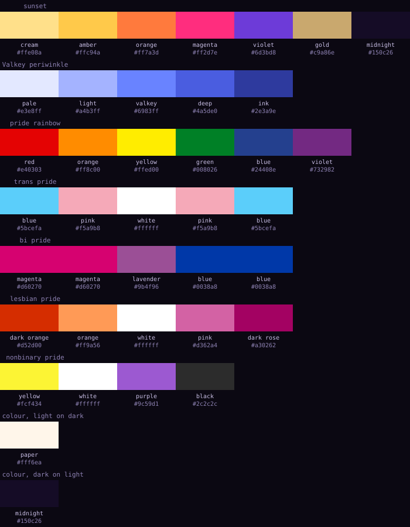
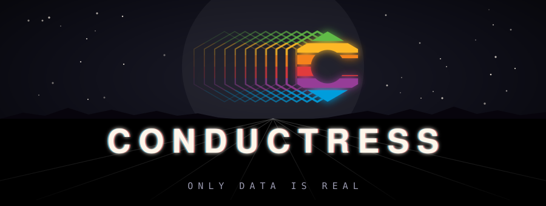

# Conductress brand

Everything needed to put the Conductress mark on a README, a dashboard, a
terminal, or a slide, plus the rules that keep it the same mark in each place.

  

## The mark

The mark is a **C** cut from a striped, pointy-top hexagon. Each part means
something:

- **The hexagon** is Valkey's shape. Conductress benchmarks Valkey, and the
  hexagon says so without borrowing Valkey's actual logo. It is always
  pointy-top, because that is the orientation of the Valkey mark.
- **The stripes** are the striped sun of an 80s sunset, and they are bars of
  data. The gradient runs once across the whole mark, cream at the top point
  to violet at the bottom, never per stripe.
- **The keyhole**, a circle opened sideways through a channel, turns the
  hexagon into the letter C and echoes the keyhole in the Valkey mark.
- **The trail** of hexagon outlines behind it, thinning and fading to the
  left, is the C in motion. The tool measures speed.

The subtitle is **ONLY DATA IS REAL**.

## Assets

| File | What it is | Use it for |
|---|---|---|
| `logo/conductress-hero.svg` / `.png` (1800x680) | Full scene: sky, grid horizon, streaks, trail, C, wordmark, subtitle. Opaque. | README top, social preview, slides |
| `logo/conductress-lockup.svg` | Streaks, trail, C, wordmark, subtitle on a **transparent** background | Dashboard header, docs, anywhere the page supplies the background |
| `logo/conductress-wordmark.svg` | CONDUCTRESS alone, with its chromatic fringe | Beside a mark that is placed separately |
| `logo/conductress-mark.svg` / `-512.png` / `-180.png` | The C alone, 7 stripes | 64px and up; app icon; apple-touch-icon (180) |
| `logo/conductress-mark-32.svg` / `-32.png` | The C, 5 stripes | 32 to 63px |
| `logo/conductress-mark-16.svg` / `-16.png` | The C, 3 stripes | 16px favicon |
| `logo/favicon.ico` | 16 + 32 + 48 bundled | `<link rel="icon">` |
| `pride/...` | The same set in the rainbow palette (see below) | June, or whenever you choose |
| `terminal/conductress-logo-ascii.py` and `*.ansi` | The lockup for a Linux terminal | CLI banner, TUI splash, MOTD |
| `motion/conductress-signon.html` | The animated sign-on | Dashboard loading screen, talk openers |

Every SVG has its type converted to outlines, so it renders identically with no
font installed. All assets are generated by `tools/build.py` from one source of
truth; edit the generator, not the SVGs, and commit both.

## Which lockup where

**Hero** when the logo owns the surface: the top of the README, the first
slide, a social preview image. It carries its own sky and is opaque.

**Lockup** (transparent) when the logo sits on a page that already has a
background: the dashboard header, a docs sidebar. The trail is clipped out of
the lead hexagon so the keyhole and stripe gaps show the page, not trail lines.
Dark backgrounds only; the cream wordmark disappears on white.

**Mark alone** below about 200px wide, where the wordmark stops being legible.
Pick the cut by rendered size, not by file preference: the 7-stripe mark turns
into a gradient blob below 64px, so 32-63px uses the 5-stripe cut and 16px uses
the 3-stripe cut. The trail never appears below 64px; at that size it is a
smear attached to a blob.

**Terminal** for the CLI banner and TUI splash. See `terminal/`.

Clear space: keep at least half a hexagon width of empty space around the mark
or lockup. Do not put the lockup on a photograph or on top of a chart.

## Colour

The sunset palette, on midnight:

| Role | Hex |
|---|---|
| Cream (top of the mark) | `#ffe08a` |
| Paper (wordmark face) | `#fff6ea` |
| Amber | `#ffc94a` |
| Orange | `#ff7a3d` |
| Magenta | `#ff2d7e` |
| Violet (bottom of the mark) | `#6d3bd8` |
| Midnight (background) | `#150c26` |
| Gold (subtitle) | `#c9a86e` |

The mark's gradient stops, top to bottom: cream 0%, amber 28%, orange 56%,
magenta 82%, violet 100%. The trail runs violet to magenta to amber, left to
right. The wordmark is cream with a 2px magenta fringe to the right and a 2px
amber fringe to the left.

Why sunset and not the neon magenta-and-cyan the genre defaults to: magenta
and cyan are load-bearing series colours in Conductress's own charts. A mark
in those colours would read as a data element in the dashboard. Amber and
violet are not chart colours, so the mark stays a mark.

For terminals that cannot do 24-bit colour, `terminal/conductress-logo-256.ansi`
uses the nearest xterm-256 cube entries; the gradient steps slightly but the
palette holds.

## Pride variant

The stripes become the six bands of the 1977 Apple logo, in Apple's order top
to bottom: green `#61bb46`, yellow `#fdb827`, orange `#f5821f`, red `#e03a3e`,
purple `#963d97`, blue `#009ddc`. The trail takes the same six bands, so it
still reads as the C smearing rather than a second object. The ground is
near-black rather than midnight, because a tinted sky fights six saturated
hues. The 16px cut merges the bands in pairs.

  

This is the only sanctioned recolour of the mark. It is the June variant, and
it is available any time the project wants it.

## Wordmark and subtitle

The wordmark is CONDUCTRESS in Nimbus Sans Bold (URW's Helvetica) at 54 units
with 13 units of letter-spacing, centred under the mark. It is shipped as
outlines; if you must set it live, use Helvetica Neue Bold, Helvetica Bold, or
Arial Bold with the same tracking.

The subtitle is ONLY DATA IS REAL in DejaVu Sans Mono at 15 units with 8 units
of letter-spacing, gold, under a two-line rule that fades out at both ends. Any
monospace face is acceptable when set live.

The lockup does not use the mark in place of the letter C in the wordmark.
That was tried; the wordmark's C stays a letter.

## Terminal

`terminal/conductress-logo-ascii.py` renders the mark and lockup for a Linux
terminal at 44px and 24px. The default output uses half-block glyphs (two
square pixels per cell, true colour per pixel, so the gradient survives);
`--quadrant` uses quadrant glyphs for finer diagonals at one colour per cell;
`--ascii` is 7-bit `#` only; `--colors 256` for older terminals;
`--palette rainbow` for the pride variant; `--mark-only` drops the text. The
`.ansi` files are pre-rendered output; `cat` one to see it.

The wordmark in the terminal lockup carries the mark's gradient letter by
letter, which is the one place the wordmark is not cream.

## Motion

`motion/conductress-signon.html` is a self-contained six-and-a-half-second
sign-on in the tradition of Cinemaware and Amiga title cards. Open it in a
browser and PRESS START (browsers require a click before audio).

The beats: the grid horizon draws itself from the vanishing point; the trail
screams in from the left and the C snaps into place with a flare; the stripes
fill bottom-up like a VU meter; CONDUCTRESS slams in letter by letter with the
chromatic split converging to its resting fringe; the rule wipes and the
subtitle types itself. The resting frame is the hero lockup.

The score is synthesised live in WebAudio. The default is **COSMOS**: a sub
drone, slow chorused pads on Lydian voicings, glass bells, long reverb, no
percussion. Four alternatives are selectable on the start card. The CRT
overlay (scanlines, vignette, end flicker) is off by default; it is a toggle on
the start card, or add `?crt` to the URL. `?t=SECONDS` freezes the sequence at
a timestamp for frame capture.

## Don'ts

- No flat-top hexagons. Pointy-top only, matching Valkey.
- No per-stripe recolouring, and no gradient that restarts on each stripe.
- No trail below 64px, and no 7-stripe mark below 64px.
- No second light source in the hero. The scene works because there is one.
- No other recolour than the pride variant. In particular, no neon
  magenta-cyan version: it collides with the chart palette.
- Do not use the actual Valkey logo in Conductress material. The hexagon is
  the reference; the mark itself belongs to LF Projects.
- Do not stretch, rotate, outline, or drop-shadow the mark.

## Licence

The Conductress code is under the repository's BSD 3-Clause licence. The brand
assets in this directory are under [CC BY 4.0](LICENSE): use and adapt them
with attribution, but do not present a fork or an unrelated project as
Conductress.
