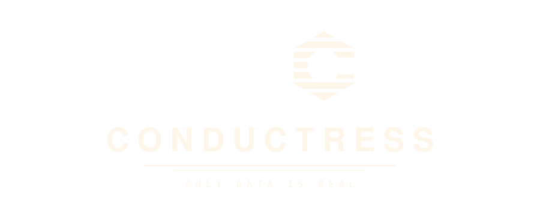

# Conductress brand

Everything needed to put the Conductress mark on a README, a dashboard, a
terminal, or a slide, plus the rules that keep it the same mark in each place.

  

## The mark

The mark is a **C** cut from a striped, pointy-top hexagon. Each part means
something:

- **The hexagon** is Valkey's shape. Conductress benchmarks Valkey, and the
  hexagon says so without borrowing Valkey's actual logo. It is always
  pointy-top, because that is the orientation of the Valkey mark.
- **The stripes** are the striped sun of an 80s sunset, and they are bars of
  data. The gradient runs once across the whole mark, cream at the top point
  to violet at the bottom, never per stripe.
- **The keyhole**, a circle opened sideways through a channel, turns the
  hexagon into the letter C and echoes the keyhole in the Valkey mark.
- **The trail** of hexagon outlines behind it, thinning and fading to the
  left, is the C in motion. The tool measures speed.

The subtitle is **ONLY DATA IS REAL**.

## Assets

| File | What it is | Use it for |
|---|---|---|
| `logo/conductress-hero.svg` / `.png` (1800x680) | Full scene: starfield, mountain horizon, grid, streaks, trail, C, wordmark, subtitle. Opaque. Identical to the sign-on's resting frame. | README top, social preview, slides |
| `logo/conductress-lockup.svg` | Streaks, trail, C, wordmark, subtitle on a **transparent** background | Dashboard header, docs, anywhere the page supplies the background |
| `logo/conductress-wordmark.svg` | CONDUCTRESS alone, with its chromatic fringe | Beside a mark that is placed separately |
| `logo/conductress-mark.svg` / `-512.png` / `-180.png` | The C alone, 7 stripes | 64px and up; app icon; apple-touch-icon (180) |
| `logo/conductress-mark-32.svg` / `-32.png` | The C, 5 stripes | 32 to 63px |
| `logo/conductress-mark-16.svg` / `-16.png` | The C, 3 stripes | 16px favicon |
| `logo/favicon.ico` | 16 + 32 + 48 bundled | `<link rel="icon">` |
| `pride/`, `trans/`, `bi/`, `lesbian/`, `nonbinary/` | The same set in each flag palette | June, or whenever you choose |
| `valkey/` | The same set in Valkey's periwinkle, as a tonal ramp | Co-branded surfaces: a ValkeyConf slide, a Valkey-hosted page |
| `mono/` | One flat colour, stencil-safe (explicit paths, no clip/gradient/opacity): light-on-dark (`-mono-light`) and dark-on-light (`-mono-dark`), each with a `-plain` no-trail lockup. No hero. | Shirts, embroidery, vinyl, engraving, one-ink print |
| `terminal/conductress-logo-ascii.py` and `*.ansi` | The lockup for a Linux terminal | CLI banner, TUI splash, MOTD |
| `motion/conductress-signon.html` | The animated sign-on | Dashboard loading screen, talk openers |

Every SVG has its type converted to outlines, so it renders identically with no
font installed. All assets are generated by `tools/build.py` from one source of
truth; edit the generator, not the SVGs, and commit both.

## Which lockup where

**Hero** when the logo owns the surface: the top of the README, the first
slide, a social preview image. It carries its own sky and is opaque.

**Lockup** (transparent) when the logo sits on a page that already has a
background: the dashboard header, a docs sidebar. The trail is clipped out of
the lead hexagon so the keyhole and stripe gaps show the page, not trail lines.
Dark backgrounds only; the cream wordmark disappears on white.

**Mark alone** below about 200px wide, where the wordmark stops being legible.
Pick the cut by rendered size, not by file preference: the 7-stripe mark turns
into a gradient blob below 64px, so 32-63px uses the 5-stripe cut and 16px uses
the 3-stripe cut. The trail never appears below 64px; at that size it is a
smear attached to a blob.

**Terminal** for the CLI banner and TUI splash. See `terminal/`.

Clear space: keep at least half a hexagon width of empty space around the mark
or lockup. Do not put the lockup on a photograph or on top of a chart.

## Colour

The sunset palette, on midnight. The strip below shows every palette in this
directory, one row each; the table covers the primary one.

| Role | Hex |
|---|---|
| Cream (top of the mark) | `#ffe08a` |
| Paper (wordmark face) | `#fff6ea` |
| Amber | `#ffc94a` |
| Orange | `#ff7a3d` |
| Magenta | `#ff2d7e` |
| Violet (bottom of the mark) | `#6d3bd8` |
| Midnight (background) | `#150c26` |
| Gold (subtitle) | `#c9a86e` |

The mark's gradient stops, top to bottom: cream 0%, amber 28%, orange 56%,
magenta 82%, violet 100%. The trail runs violet to magenta to amber, left to
right. The wordmark is cream with a 2px magenta fringe to the right and a 2px
amber fringe to the left.

Why sunset and not the neon magenta-and-cyan the genre defaults to: magenta
and cyan are load-bearing series colours in Conductress's own charts. A mark
in those colours would read as a data element in the dashboard. Amber and
violet are not chart colours, so the mark stays a mark.

For terminals that cannot do 24-bit colour, `terminal/conductress-logo-256.ansi`
uses the nearest xterm-256 cube entries; the gradient steps slightly but the
palette holds.

## Flag variants

The stripes are a natural place for a flag, and the mark carries several. In
each, the trail takes the same bands so it still reads as the C smearing rather
than a second object; the wordmark's chromatic fringe takes two of the flag's
colours; the sky stays midnight except for the rainbow, whose six saturated
hues fight any tint, so it sits on near-black.

- **Pride rainbow** (`pride/`): the six bands of the 1977 Apple logo, in
  Apple's order. The 16px cut merges the bands in pairs.
- **Trans** (`trans/`): blue, pink, white, pink, blue. The white band falls on
  the keyhole channel, so it survives only as the C's left arm, which reads
  correctly as the flag's centre.
- **Bi** (`bi/`): magenta, lavender, blue in the flag's 2:1:2 proportions,
  laid out as five stripes so the lavender is one band wide.
- **Lesbian** (`lesbian/`): the five-stripe sunset flag, dark orange to dark
  rose with white at the centre; it is close kin to the primary palette.
- **Nonbinary** (`nonbinary/`): yellow, white, purple, black. The black band is
  the flag's `#2c2c2c`, kept as-is: on the midnight sky it reads as a dark grey
  sliver at the base rather than a full stripe. Where it needs to read on a
  dark ground, give the mark a contrasting backing or an outline rather than
  changing the colour; on a light ground (the transparent lockup on paper) it
  reads fully.

  

These, plus the two below, are the sanctioned recolours. Adding another is one
entry in `PALETTES` in `tools/build.py`.

## Valkey periwinkle

`valkey/` recolours the mark as a tonal ramp around Valkey's brand periwinkle
`#6983ff`, pale at the top point to ink at the base, with the trail, grid and
rule in the same family on a blue-black sky. Use it where Conductress appears
inside Valkey's visual world, such as a ValkeyConf slide or a page on a Valkey
property, where the sunset would fight the host palette. It is a courtesy
variant, not an implication of endorsement; see the trademark note.

## One colour (stencil)

`mono/` is the mark and lockup in a single flat colour for anything that
cannot carry a gradient or a tint: shirts, embroidery, vinyl, laser engraving,
one-ink print, a favicon on themed browser chrome. `-mono-light` is paper
`#fff6ea` for dark grounds; `-mono-dark` is midnight `#150c26` for light ones.

These files are built differently from the rest, and that is the point:

- Every piece of the C is an explicit closed path. There is no `clipPath`,
  gradient, filter, or opacity anywhere in the file, because cutters and
  embroidery digitizers (Cricut, Silhouette, Ink/Stitch) commonly ignore
  clipping and cannot do 40% ink. The 7-stripe C is nine pieces: five whole
  stripes and two that the keyhole splits.
- The trail fades by stroke width alone, 0.5 to 3.2 units, and each outline
  is emitted only where it lies outside the lead hexagon, so nothing is cut
  or stitched twice.
- `-plain` drops the trail: mark, wordmark, subtitle. Ten overlapping outlines
  are a lot of thread and a fragile stencil; for a chest print or a patch,
  plain is the one to use.

It is also the honest test of the mark: the C has to read with the stripes and
nothing else, and it does, down to the 3-stripe cut.

  

## Wordmark and subtitle

The wordmark is CONDUCTRESS in Nimbus Sans Bold (URW's Helvetica) at 54 units
with 13 units of letter-spacing, centred under the mark. It is shipped as
outlines; if you must set it live, use Helvetica Neue Bold, Helvetica Bold, or
Arial Bold with the same tracking.

The subtitle is ONLY DATA IS REAL in DejaVu Sans Mono at 15 units with 8 units
of letter-spacing, gold, under a two-line rule that fades out at both ends. Any
monospace face is acceptable when set live.

The lockup does not use the mark in place of the letter C in the wordmark.
That was tried; the wordmark's C stays a letter.

## Terminal

`terminal/conductress-logo-ascii.py` renders the mark and lockup for a Linux
terminal at 44px and 24px. The default output uses half-block glyphs (two
square pixels per cell, true colour per pixel, so the gradient survives);
`--quadrant` uses quadrant glyphs for finer diagonals at one colour per cell;
`--ascii` is 7-bit `#` only; `--colors 256` for older terminals;
`--palette rainbow` for the pride variant; `--mark-only` drops the text. The
`.ansi` files are pre-rendered output; `cat` one to see it.

The wordmark in the terminal lockup carries the mark's gradient letter by
letter, which is the one place the wordmark is not cream.

## Motion

`motion/conductress-signon.html` is a self-contained six-and-a-half-second
sign-on in the tradition of Cinemaware and Amiga title cards. Open it in a
browser and PRESS START (browsers require a click before audio).

The beats: the grid horizon draws itself from the vanishing point; the trail
screams in from the left and the C snaps into place with a flare; the stripes
fill bottom-up like a VU meter; CONDUCTRESS slams in letter by letter with the
chromatic split converging to its resting fringe; the rule wipes and the
subtitle types itself. The resting frame is the hero lockup.

The score is synthesised live in WebAudio. The default is **COSMOS**: a sub
drone, slow chorused pads on Lydian voicings, glass bells, long reverb, no
percussion. Four alternatives are selectable on the start card. The CRT
overlay (scanlines, vignette, end flicker) is off by default; it is a toggle on
the start card, or add `?crt` to the URL. `?t=SECONDS` freezes the sequence at
a timestamp for frame capture.

## Don'ts

- No flat-top hexagons. Pointy-top only, matching Valkey.
- No per-stripe recolouring, and no gradient that restarts on each stripe.
- No trail below 64px, and no 7-stripe mark below 64px.
- No second light source in the hero. The scene works because there is one.
- No recolours beyond the ones in this directory. In particular, no neon
  magenta-cyan version: it collides with the chart palette. A new flag or
  co-brand palette is added to `tools/build.py`, not improvised in place.
- Do not use the actual Valkey logo in Conductress material. The hexagon is
  the reference; the mark itself belongs to LF Projects.
- Do not stretch, rotate, outline, or drop-shadow the mark.

## Licence and trademark

The Conductress code is under the repository's BSD 3-Clause licence. The
artwork in this directory is under [CC BY 4.0](LICENSE): copy and adapt it with
attribution.

Copyright is not the thing that protects a logo, though. The name
"Conductress" and the keyhole-C mark identify this project; they are
unregistered marks, and [LICENSE](LICENSE) carries the usage statement: refer
to Conductress freely, adapt the artwork for the project freely, but do not use
the name or mark as the identity of a fork, a derivative, or anything the
project did not produce. A fork should pick its own name and mark.
